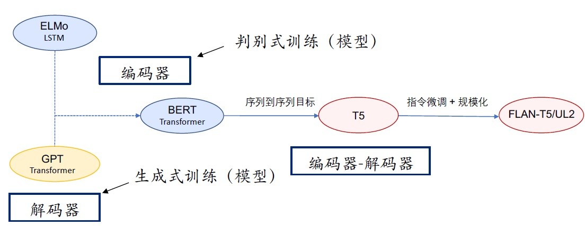
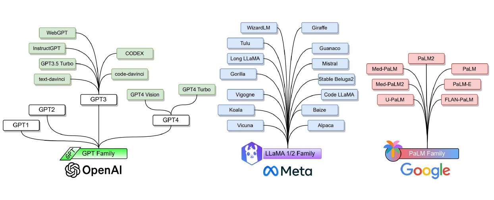

# Study-Walk-in-LLM

**介绍**  
本项目用于个人学习大语言模型，记录学习期间的收获。

**参考**  
[大模型通识课](https://github.com/Lordog/dive-into-llms?tab=readme-ov-file)  
[大模型实战营](https://github.com/InternLM/Tutorial)

**其他**  
Good luck!
